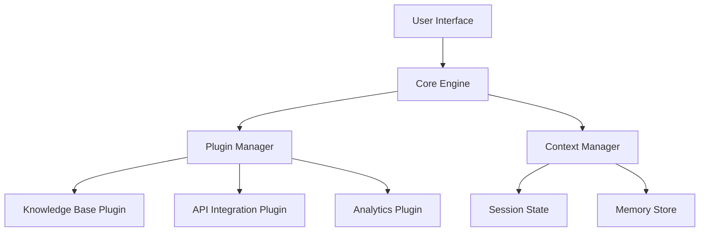

# Aurora AI Overview

This documentation provides an overview of Aurora AI, its architecture, and how it works.

## Architecture

AuroraAI follows a modular, plugin-based architecture that enables extensibility and scalability:

## Supported Models

AuroraAI supports multiple AI model providers to suit different use cases and deployment requirements:

| Provider | Model | Context Window | Best For |
|----------|-------|----------------|----------|
| OpenAI | GPT-4 Turbo | 128K tokens | Complex reasoning, code generation |
| OpenAI | GPT-3.5 Turbo | 16K tokens | Fast responses, general queries |
| Anthropic | Claude 3 Opus | 200K tokens | Long document analysis |
| Anthropic | Claude 3 Sonnet | 200K tokens | Balanced performance |
| Local | Llama 2 | 4K tokens | Privacy-sensitive deployments |

## System Requirements

| Component | Minimum | Recommended |
|-----------|---------|-------------|
| CPU | 4 cores | 8+ cores |
| RAM | 8 GB | 16+ GB |
| Storage | 10 GB | 50+ GB (with local models) |
| Network | 10 Mbps | 100+ Mbps |

## Plugin Ecosystem

AuroraAI's functionality can be extended through plugins:

- **Documentation Plugins**: Confluence, SharePoint, Notion, GitBook
- **Development Tools**: GitHub, GitLab, Jira, Linear
- **Communication**: Slack, Microsoft Teams, Discord
- **Data Sources**: SQL databases, REST APIs, GraphQL endpoints

## Security & Compliance

- **Authentication**: OAuth 2.0, SAML, API keys
- **Encryption**: AES-256 at rest, TLS 1.3 in transit
- **Access Control**: Role-based permissions (RBAC)
- **Audit Logging**: Complete activity tracking
- **Compliance**: SOC 2 Type II, GDPR, HIPAA-ready

## Performance Metrics

Typical response times under standard load:

| Operation | Avg Response Time | Throughput |
|-----------|------------------|------------|
| Simple query | < 2 seconds | 100 req/min |
| Document search | < 3 seconds | 60 req/min |
| Code generation | 3-5 seconds | 40 req/min |
| Long document analysis | 8-15 seconds | 20 req/min |

## What Is AuroraAI?
AuroraAI is a lightweight, multimodal AI assistant designed to help teams write, search, analyze, and automate workflows across enterprise environments. It integrates seamlessly with documentation platforms, internal tools, and external APIs.

## Key Features
- Natural language understanding for queries, tasks, and workflows.
- Plugin-based architecture for integrating knowledge bases, project systems, and developer tools.
- Context-aware responses optimized for technical writing and software development.
- Secure by design, with role-based access and encrypted local config.

## Ideal Use Cases
- Generating and editing documentation.
- Summarizing tickets, requirements, and engineering discussions.
- Producing API specs, code snippets, troubleshooting trees, and templates.
- Providing real-time answers based on uploaded files or internal docs.

